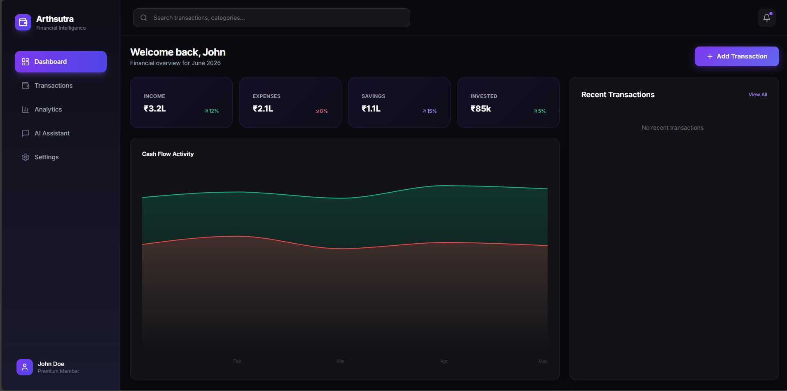
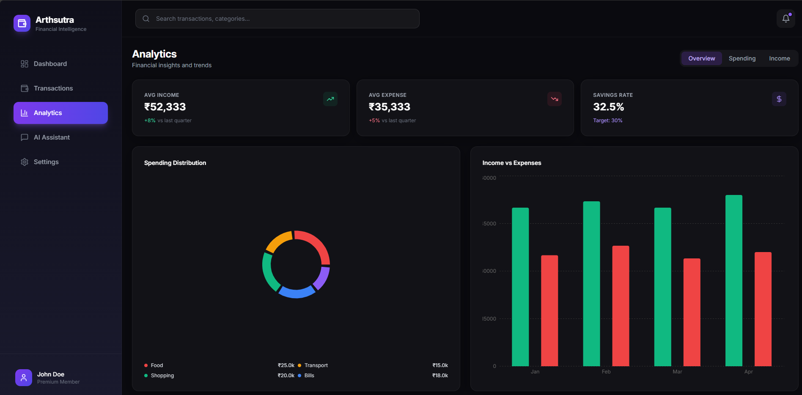
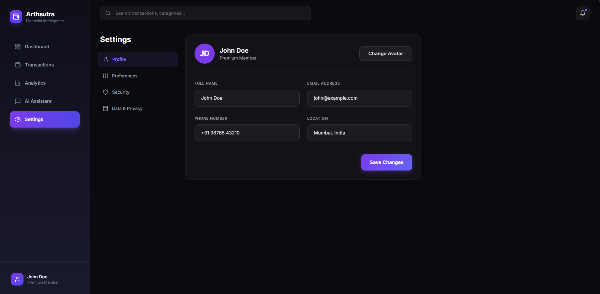

# Arthsutra (अर्थसूत्र) - AI Personal Finance Manager

Arthsutra is a modern, professional-grade personal finance management application powered by AI. It features a "screen-fit" dashboard design that eliminates unnecessary scrolling, providing a dense, information-rich interface for tracking income, expenses, and investments.



## 🚀 Key Features

- **Screen-Fit Dashboard**: A responsive, grid-based layout that shows all critical metrics (Cashflow, Stats, Recent Transactions) in a single view without scrolling.
- **AI Financial Assistant**: Integrated Chat interface to ask questions about your finances, analyze spending patterns, and get advice.
- **Advanced Analytics**: Interactive charts for Income vs. Expense trends, Category breakdowns, and Savings rates.
- **Transaction Management**: Searchable, filterable transaction history with sticky headers to manage large datasets easily.
- **Tabbed Settings**: Organized configuration for Profile, Preferences, Security, and Data Management.
- **Modern UI/UX**: Built with Glassmorphism aesthetics, Dark Mode by default, and smooth transitions.

## 🛠️ Tech Stack

### Frontend
- **Framework**: React 18 + Vite
- **Styling**: Tailwind CSS (Custom Dark Theme)
- **Icons**: Lucide React
- **Charts**: Recharts
- **State**: React Hooks

### Backend
- **API**: FastAPI (Python 3.12+)
- **Database**: SQLite (SQLAlchemy ORM)
- **Validation**: Pydantic V2
- **AI Integration**: Ollama (Llama 3 support)

## 📸 Screenshots

### 1. Main Dashboard
*Real-time overview of your financial health with cashflow charts and recent activity.*


### 2. Analytics & Insights
*Deep dive into spending habits and income trends.*


### 3. AI Financial Assistant
*Chat with your AI advisor to analyze spending and get financial advice.*


### 4. Settings & Preferences
*Manage your profile and application preferences.*


## 🔧 Installation & Setup

### Prerequisites
- Python 3.10 or higher
- Node.js 18 or higher
- Git

### 1. Clone the Repository
```bash
git clone https://github.com/rvsaraswat/arthsutra.git
cd arthsutra
```

### 2. Backend Setup
```bash
cd backend
python -m venv .venv

# Activate Virtual Environment
# Windows:
.venv\Scripts\activate
# Linux/Mac:
source .venv/bin/activate

pip install -r requirements.txt
python -m uvicorn main:app --reload
```
*The backend API will run at http://localhost:8000*

### 3. Frontend Setup
Open a new terminal:
```bash
cd frontend
npm install
npm run dev
```
*The frontend will run at http://localhost:5173*

## 🤝 Contributing
Contributions are welcome! Please feel free to submit a Pull Request.

## 📄 License
This project is licensed under the MIT License.
